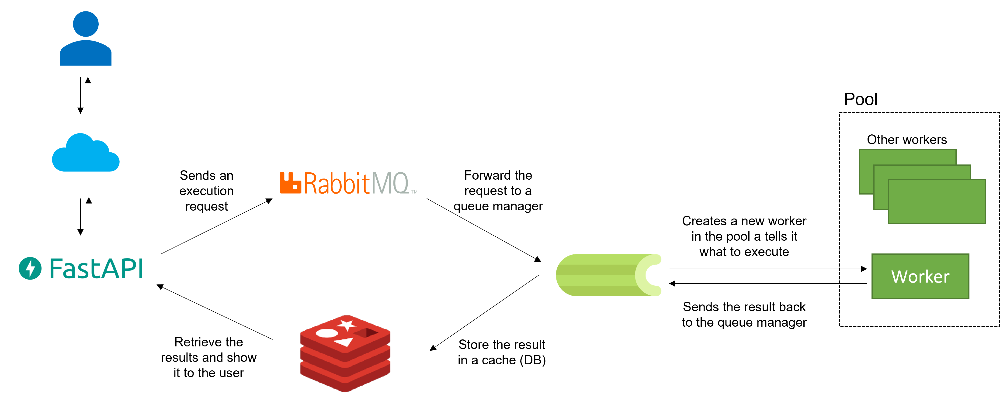

============
API overview
============

In this page we provide a brief overview of our deployment setup while explaining the reasons behind
out choices. 

.. note::
    Deployment setups diffeere from problem to problem, and out proposed solution may not work for a particular
    use case. It is not our idea to impose a particular deployment solution.

In this project we are going to use the following open source modules:

    * :ref:`FastAPIref`
    * :ref:`Celeryref`
    * :ref:`Redisref`
    * :ref:`RabbitMQref`

Basic deployment schema
=======================

In our setup we have:

    * The user creates a request through a standard interface provided by FastAPI, the request will be processed and sent to the message broker RabbitMQ
    * RabbitMQ will receive the message, process it, and forward it to Celery so it can understand what has to be executed in a *worker* and what are the parameters to use
    * Once the task is finished Celery retrieves the result and store is in a cache system like Redis
    * FastAPI pulls the results from the cache and show it to the user

.. note::

    Our deployment was built as an advanced toy example to show how many components are needed and how they should interact to deploy a system.
    Things like security, hardware scalability, extensive testing, CI, etc... are not considered but necessarly for a real world application.

.. _FastAPIref:

FastAPI
=======

`FastAPI`_ is a open source Python web framework for building APIs.

With FastAPI we defined how the user interact with our application. We implemented routes for:

    * Submitting an inference task
    * Retriving the predictions
    * Choose the prefered place among the predicted ones
    * Training a new model
    * Get some statistics for monitoring the system

An example of how you can define a route with this library is

More specifically, we implemented the following API:

.. csv-table::
    :header: "Route", "Description"

    "/inference/start", "Start a new inference task with the current model"
    "/inference/status/{task_id}", "Retrieve the state of the inference task started"
    "/inference/results/{task_id}", "Get the prediction from the model once the inference task is finished"
    "/inference/select/", "Select the best place among the top ranked places"
    "/train/start", "Train a new model"
    "/content/{value}", "Get monitoring statistics"

As an example of how the routes are implemented, the following snippet shows the
code for route: */inference/start*:

.. literalinclude:: ../../../api/routes.py
    :language: python
    :lines: 50-64
    

.. _Celeryref:

Celery
======

`Celery`_ is a distributed task queue that process messages and provides the tools to scheduling tasks.

We use Celery to perform some computational instensive tasks in an asynchronous way. It is very important
to consider that providing just a web application to a user is not enough, if the user starts a heavy task like
an inference, it could be quite annoying to have the website freezed for until the task ends.

Celery needs a startup file and a configuration file, and writing them could be quite challenging for complex system.
In out example we kept them easy and configure just the bare minimum to make it work as intended.

**celery.py**

.. literalinclude:: ../../../worker/celery.py
    :language: python

**celeryconfig.py**

.. literalinclude:: ../../../worker/celeryconfig.py
    :language: python

Basically, we tell celery where is the code to run in **celeryconfig.py** and how to start itself in **config.py**.
The environments variable used in the latter file have to be set at system level, in our case their values are:

.. code-block:: python

    CELERY_BROKER_URL=pyamqp://rabbitmq/
    CELERY_BACKEND_URL=redis://redis/

Deploying a system that scale up with the computational load is mandatory, we implemented two tasks in Celery:

    * Model training
    * Inference on the trained model

To show an example, the following snippet implements the asynchronous inference on a trained model:

.. literalinclude:: ../../../worker/tasks/inference.py
    :language: python
    :lines: 26-

.. _Redisref:

Redis
=====

`Redis`_ is a NoSQL in-memory data store that we use as a cache to temporarly store results from the asynchronous tasks.

In our deployment setup this NoSQL database is only used by FastAPI and Celery to exchange data. Since both Celery and
FastAPI has a very good compatibily with Redis, the solution is basically plug & play and does not need configuration.

.. _RabbitMQref:

RabbitMQ
========

`RabbitMQ`_ is a message broker that we use as middleware to send messages to Celery. 

A message broker is usually necessarly when two modules needs a translation layer to communicate correctly. RabbitMQ is a
well supported solution which provides a web-based graphical interface useful to monitoring the intercommunation.

RabbitMQ has a lot of customizations, but we run it in very basic setup for out toy example.

.. _FastAPI: https://fastapi.tiangolo.com/
.. _Celery: https://docs.celeryq.dev/en/stable/
.. _Redis: https://redis.io/
.. _RabbitMQ: https://www.rabbitmq.com/